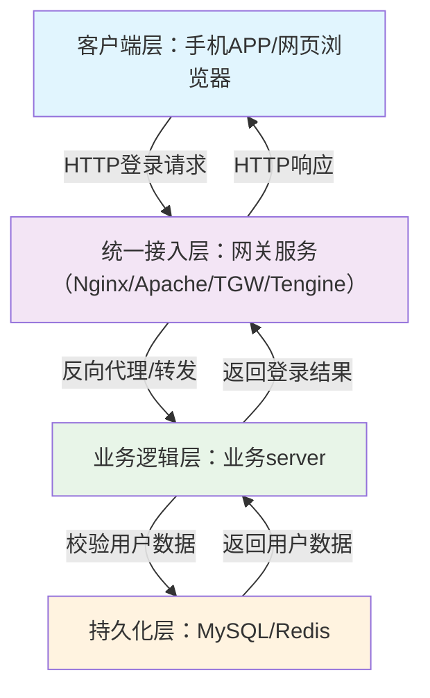
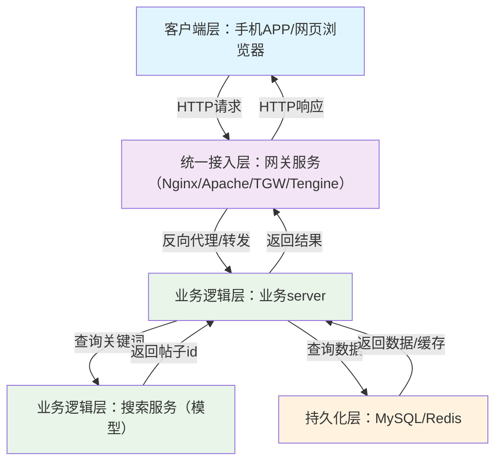

---
layout: post         
title: "后端开发如何理解模型"
date: 2025-12-18
---  

互联网后端工程师该如何理解「模型」？模型在生产链路中又处于怎样的位置？
<!-- more -->

## 背景
本文从传统后台开发的视角，聊聊该如何理解模型，以及模型在生产链路中所处的位置。

## 传统的互联网在线后端架构
我们先简单看一下传统的互联网后台服务是怎样的。

以在线服务为例，考虑一个最简单的登录流程。用户通过客户端发出一个登录请求，这里客户端可能是手机 APP，或者网页，不重要。假设就是一个 HTTP 请求。  
请求首先到达整个后台服务的统一接入层，也就是网关服务。开源组件如 Nginx、更老的 Apache 都属于这一层，对应腾讯的 TGW、阿里的 Tengine 等厂商定制网关。网关服务会作为反向代理，将请求转发给后台服务的逻辑层。  
这里是核心的业务逻辑 server，通常基于复杂的微服务架构实现，涉及 RPC 框架、名字服务、容器等技术 —— 比如部署在 K8S 上的各类 RPC server（腾讯 Trpc/svrkit/SPP、阿里 HSF/DUBBO、百度 Brpc），通信协议会切换为更高效、可定制的 RPC 协议（如 ProtoBuf）。  
一个简单的登录逻辑，是将输入的用户名和密码与数据库中保存的数据对比，这就需要查询持久化层（如关系型数据库 MySQL、KV 存储 Redis）。  
逻辑层设计为无状态架构，以便快速实现水平扩展，所有状态均维护在持久化层。持久化层返回数据后，逻辑层完成对比并返回结果，最终 HTTP 响应包返回客户端，整个流程结束。
## 分析这个流程
多数业务场景（如论坛、IM、电商）都可套用这一流程：用户上传内容并存储，或查询获取其他用户上传的内容。当然不同类型的内容会引入更多组件，比如视频类内容会用到对象存储、CDN 加速等。游戏类场景则差异较大，本文暂不展开分析。
从这一流程能看出，核心技术瓶颈在于 IO 操作，而计算逻辑相对轻量化。
## 不说大模型，先看搜广推模型
我们先聊聊「模型」本身，而非当下热度最高的大模型。事实上，在大模型爆发之前，搜索、广告、推荐（简称「搜广推」）这类业务的核心，就已经是基于机器学习 / 深度学习的模型了。接下来我们先聊聊该如何理解搜广推模型。
## 增加一个搜索功能
以论坛场景为例：假设用户登录论坛后，需要通过关键词搜索帖子，我们仍基于上述后台架构来实现这一功能。  
最直接的思路是：从持久化层查询所有帖子内容，逐一对比是否匹配用户关键词 —— 比如用 MySQL 的 LIKE 语句模糊匹配，甚至手写字符串匹配逻辑。但这种方式显然不可行 —— 帖子数量庞大时，逐条匹配的效率极低。  
有没有更优的方案？当然有，像 Elasticsearch 这类组件就专门解决了这个问题，其核心是通过「倒排索引」机制，实现关键词的高效检索。OK，看起来这个问题可以得到很好的解决了。  
## 改进搜索功能
如果想进一步优化搜索功能，不再局限于简单的关键词匹配，而是实现更「智能」的匹配 —— 就像有人读完了所有内容，能精准找出最贴合需求的帖子，该怎么做？
事实上，学术界和工业界的专家早已通过持续迭代的理论与算法解决了这一问题，接下来的关键是：如何将这些理论落地到工程实践中？
## 模型在工程上是什么
回到编程的基础认知：在 Linux 下编写一个 C 语言的 Hello World 程序，编译后会生成 a.out 可执行文件；运行这个文件，终端就会输出「Hello World」。
模型本质上就类似这个 a.out 文件 —— 它接收关键词作为输入，输出最匹配的帖子 ID：
``` shell
# ./a.out “天气”
# 最接近的帖子:tid100
```
模型训练的过程，就像编译 a.out 的过程 —— 基于算法将海量数据「编译」成可执行的「模型文件」（类比 a.out）；模型推理（预测），就是运行这个「模型文件」的过程。
如何将模型接入线上
此时我们已经有了模型，但原生模型只能本地运行，无法处理 RPC 请求。因此需要基于现有 RPC 框架，将模型封装成可处理 RPC 请求的「模型服务」，使其能对外提供搜索能力 —— 这一过程就是「模型上线」。

## 看起来和之前没什么不同
上线后的模型服务，和普通微服务在架构层面并无本质区别。当然这只是极简架构，实际落地会面临诸多工程问题，本文暂不展开。
搜广推类模型的特性相近，与大模型相比，它们的参数量更小，运行所需的资源开销较低。当 QPS 提升时，可像扩容普通微服务一样对模型服务做水平扩展（新增若干实例即可）。
## 大模型和之前的 “小” 模型的区别
而大模型需要的资源开销则大得多，无法简单通过水平扩容解决，因此资源使用方式也截然不同 —— 这也是当前工程领域的重要优化方向。要理解这一点，需要先掌握 GPU 的核心知识，下篇博客我们聊聊 GPU。